<p align="center">
  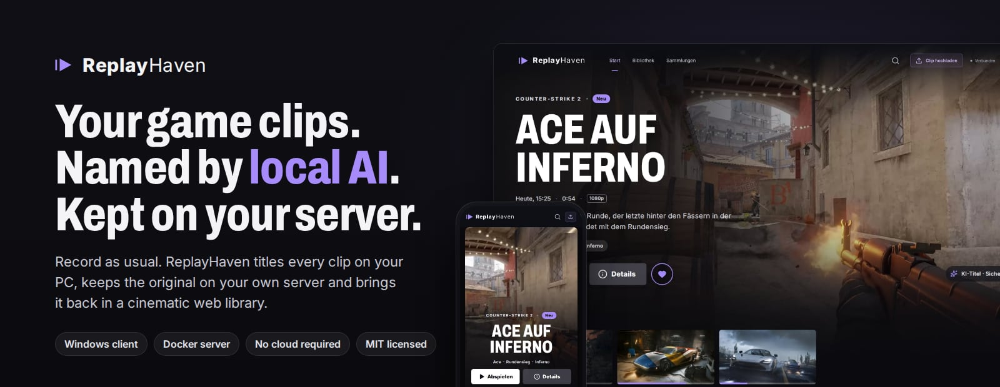
</p>

<p align="center">
  <a href="https://github.com/SauerExe/ReplayHaven/actions/workflows/ci.yml"></a>
  <a href="LICENSE"></a>
  
  
  
</p>

<p align="center">
  <b>Record as usual. ReplayHaven gives every clip a real title, keeps the original on your own server<br>and brings it back in a cinematic web library.</b>
</p>

<p align="center">
  <a href="#quick-start">Quick start</a> ·
  <a href="#screenshots">Screenshots</a> ·
  <a href="#how-it-works">How it works</a> ·
  <a href="#faq">FAQ</a> ·
  <a href="docs/START.md">Anleitung auf Deutsch</a>
</p>

---

Your clip folder probably looks like `Counter-Strike 2 2026.09.24 - 21.14.07.02.DVR.mp4`, a hundred times over. ReplayHaven turns that into **“Ace auf Inferno”** with a short description, tags and jump marks, and it does so on your own hardware: a small Windows client analyses each new recording with a local vision model, your own server keeps the original forever, and any browser in your home becomes the place to watch it again.

> **Auf Deutsch:** ReplayHaven ist ein selbst gehostetes Archiv für Gaming-Clips. Ein Windows-Client benennt neue Aufnahmen mit einer lokalen KI (Ollama, Qwen3-VL) und lädt sie auf deinen eigenen Server; dort findest du sie in einer Mediathek im Streaming-Stil wieder. Die Oberfläche ist deutsch. Die Schritt-für-Schritt-Anleitung mit Fehlerhilfe steht in **[docs/START.md](docs/START.md)**, der Serverbetrieb in **[docs/SERVER.md](docs/SERVER.md)**.

## Features

<table>
  <tr>
    <td width="50%" valign="top"><b> Clips that name themselves</b><br>A local vision model watches 24 or 48 frames of each clip and suggests a title, a description, tags and highlight timestamps.</td>
    <td width="50%" valign="top"><b> Titles that stick to the facts</b><br>Kills, deaths, round and match results are read from what the game shows on screen. A title that claims more gets one correction round, otherwise a plain title is built from the confirmed events.</td>
  </tr>
  <tr>
    <td width="50%" valign="top"><b> Your hardware, your clips</b><br>The AI runs on your gaming PC through Ollama. Clips only travel to your own server. No account, no cloud, no subscription.</td>
    <td width="50%" valign="top"><b> Originals are sacred</b><br>Nothing on the gaming PC is renamed, moved or deleted. The server keeps an untouched copy, even if you delete the file at home.</td>
  </tr>
  <tr>
    <td width="50%" valign="top"><b>  A library you want to open</b><br>The newest clip in the spotlight, rows for continue watching, new clips, favourites and each game, a detail view with the AI's jump marks, a full-screen player that skips from highlight to highlight, a library sorted by game with covers from Steam, search, filters and collections, on desktop and phone.</td>
    <td width="50%" valign="top"><b> One small container</b><br>Node.js, SQLite and FFmpeg in a single Docker image. No GPU needed on the server. Runs on a NAS, a mini PC or any Linux box.</td>
  </tr>
  <tr>
    <td width="50%" valign="top"><b> Extra precision for some games</b><br>Optional: Fortnite kills with weapon class and distance straight from the match replays, Rainbow Six map and round results from on-device text recognition.</td>
    <td width="50%" valign="top"><b> Everything stays editable</b><br>AI results are suggestions. Titles, descriptions and tags can be changed, and a title or tags you set yourself stay when a clip is analysed again.</td>
  </tr>
</table>

## Screenshots

<p align="center">
  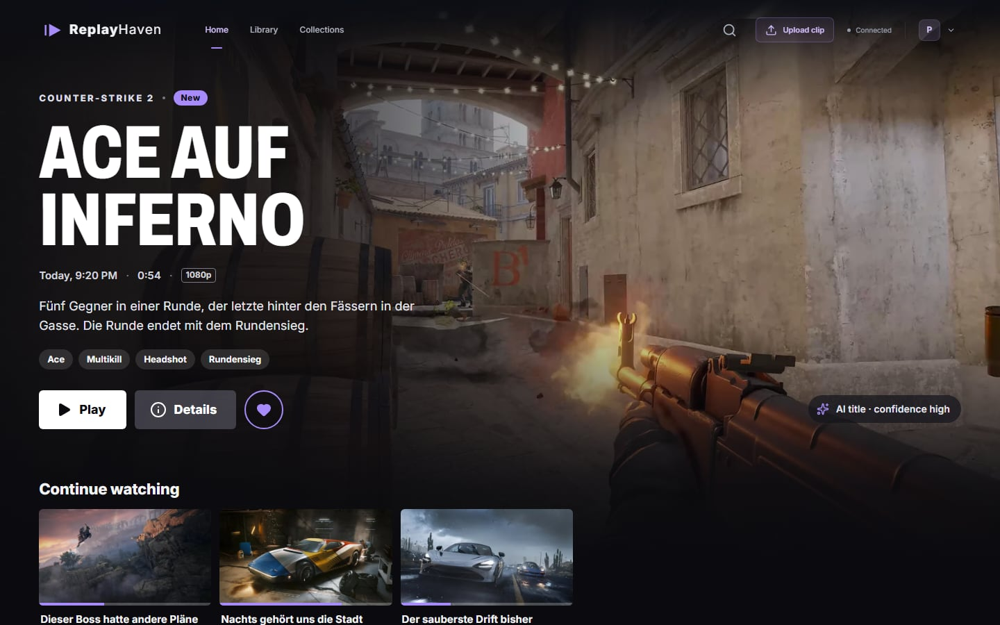
  <br><sub>The web library: the newest clip in the spotlight, everything else in rows below.</sub>
</p>

<table>
  <tr>
    <td width="50%">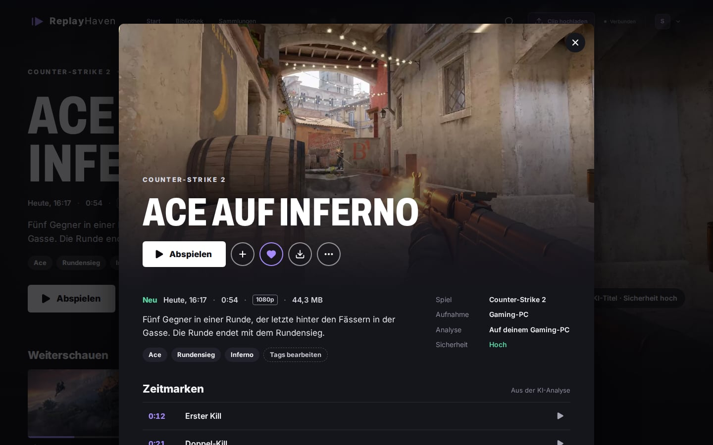<br><sub>What the local AI found in a clip: title, description, tags and jump marks.</sub></td>
    <td width="50%">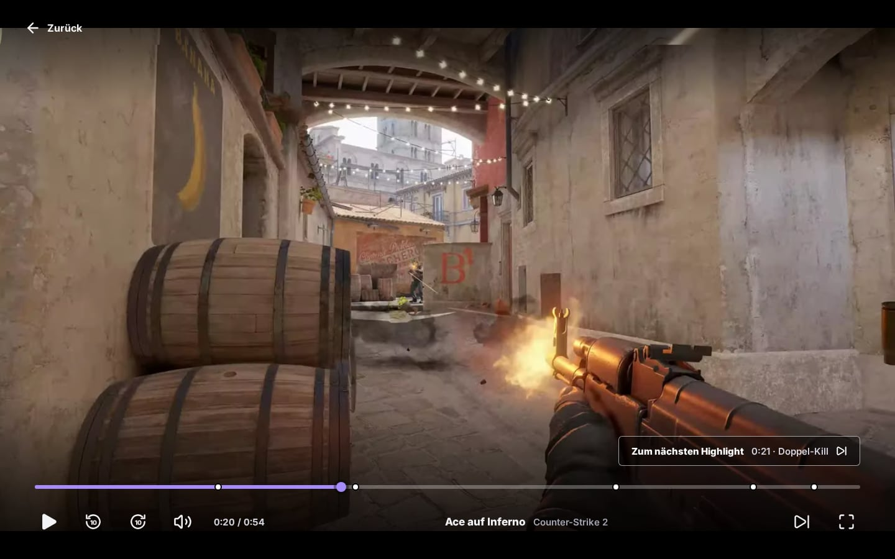<br><sub>The full-screen player marks every highlight and jumps to the next one.</sub></td>
  </tr>
  <tr>
    <td width="50%">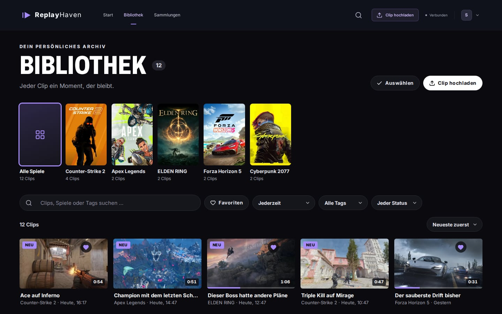<br><sub>The whole archive, by game, with search and filters.</sub></td>
    <td width="50%">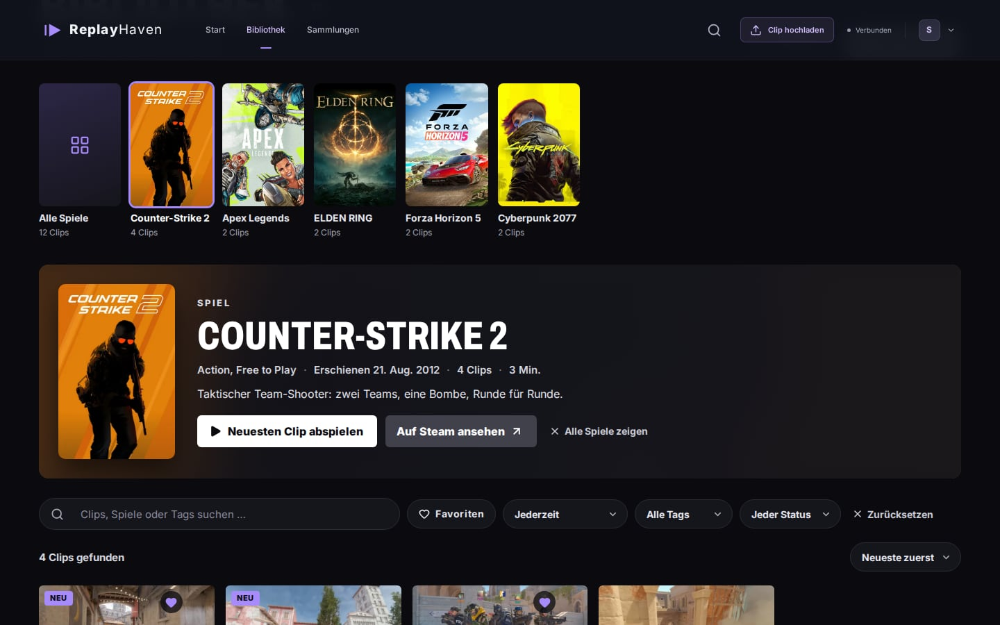<br><sub>Pick a game: cover, genre, release date and description come from Steam.</sub></td>
  </tr>
  <tr>
    <td width="50%">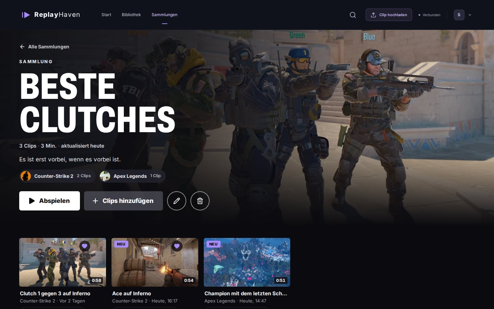<br><sub>Collections keep the best moments together and play them in order.</sub></td>
    <td width="50%">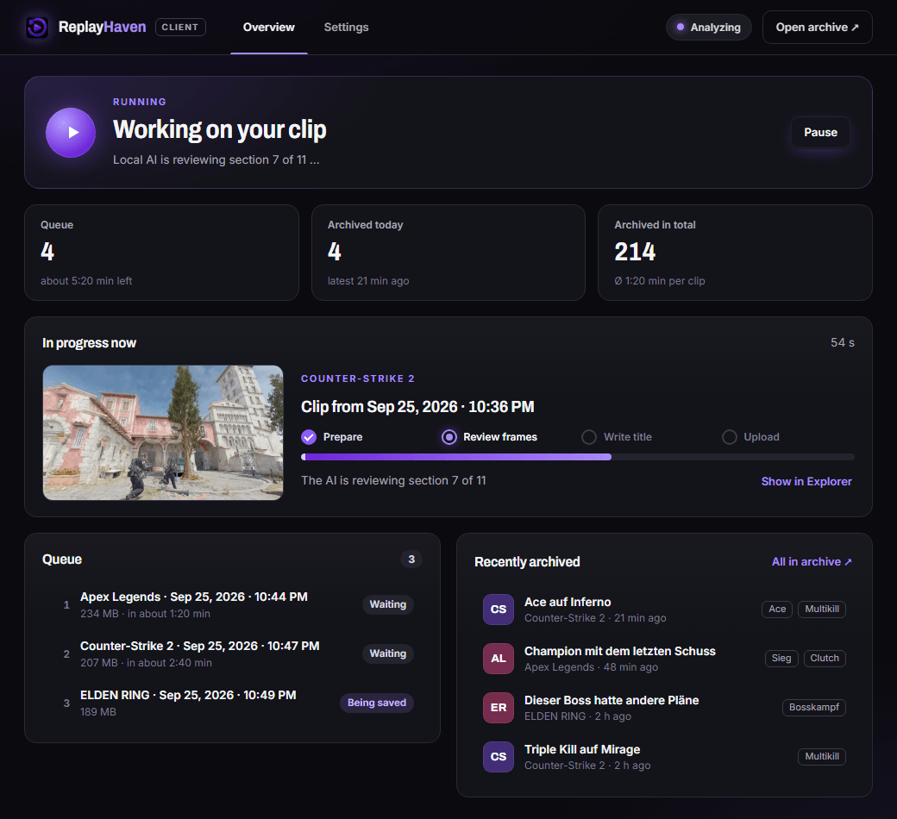<br><sub>The Windows client: pick a folder, connect your server, done.</sub></td>
  </tr>
</table>

<details>
<summary><b>On the phone</b></summary>
<p align="center">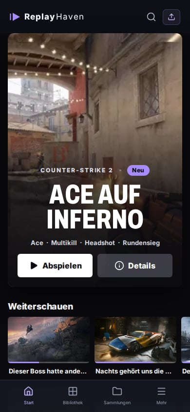</p>
</details>

<sub>Screenshots use the built-in demo artwork and example texts. The interface is German.</sub>

## How it works

<picture>
  <source media="(prefers-color-scheme: dark)" srcset="docs/images/architecture-dark.png">
  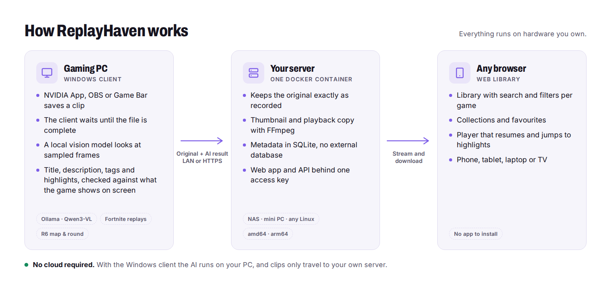
</picture>

What happens when you save a clip:

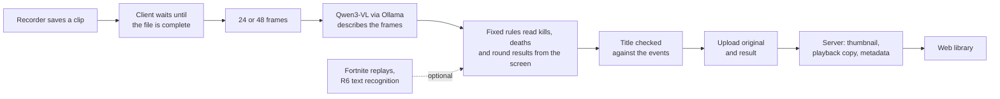

Analysis can be switched off in the client. Clips are then archived without AI metadata, and the client works as a plain upload agent.

## Quick start

You need a machine for the server (anything that runs Docker) and the Windows PC you play on. Both can be the same machine.

### 1. Server

Install Docker Engine with the Compose plugin ([guide](https://docs.docker.com/engine/install/)), then:

```bash
git clone https://github.com/SauerExe/ReplayHaven.git && cd ReplayHaven
bash setup-server.sh
```

The script asks for the server address, generates the access key, builds the image and starts it. Running it again after an update rebuilds and keeps your `.env`.

<details>
<summary><b>Without a source checkout, from a published release</b></summary>

Every release publishes a multi-arch image to `ghcr.io/sauerexe/replayhaven`.

```bash
mkdir -p replayhaven && cd replayhaven
curl -fsSLO https://raw.githubusercontent.com/SauerExe/ReplayHaven/main/compose.yaml
curl -fsSL  https://raw.githubusercontent.com/SauerExe/ReplayHaven/main/.env.example -o .env
# edit .env: REPLAYHAVEN_ACCESS_TOKEN (openssl rand -hex 24) and REPLAYHAVEN_PUBLIC_ORIGIN (http://<server-ip>:8787)
docker compose up -d
```

</details>

Open the server address in a browser, go to **Einstellungen → KI & Server** and enter the access key. The **Geräte** page offers the Windows client for download.

### 2. Gaming PC

1. Install `ReplayHaven-Client-Setup.exe` from the [releases](https://github.com/SauerExe/ReplayHaven/releases) or from your server's **Geräte** page. The installer is not code-signed yet, so SmartScreen asks for confirmation. No release yet? Build it on Windows with `npm ci && npm run client:build`.
2. Pick your recording folder (subfolders included), enter the server address and the access key.
3. Install [Ollama](https://ollama.com/download/windows) and click **Modell laden** once. It downloads Qwen3-VL 8B, about 6.1 GB.
4. Click **Analyse & Upload starten**. New recordings are analysed once they are completely written and show up in the library a minute or two later.

Pause the client while you play if you need the GPU. The full German guide with troubleshooting is [docs/START.md](docs/START.md).

## Game extras

These are optional and off by default. They add facts the frames alone cannot deliver reliably.

| Game              | What it adds                                                                       | Where it comes from                                                            |
| ----------------- | ---------------------------------------------------------------------------------- | ------------------------------------------------------------------------------ |
| Fortnite          | Your kills and knocks with weapon class and distance, your elimination and victory | The match replays Fortnite writes to `%LOCALAPPDATA%\FortniteGame\Saved\Demos` |
| Rainbow Six Siege | Map name and round results                                                         | Text recognition (PaddleOCR on ONNX Runtime) on the CPU, next to the GPU model |

Command-line tools show what these sources contribute to your own clips before you rely on them, without AI and without uploading anything: `npm run fortnite`, `npm run r6`, `npm run audio`, `npm run laughs` and `npm run r6-replays`. The research notes and measurement plans behind them are in [docs](docs) (German).

## Privacy

- **The AI runs on your PC.** With the Windows client, frames go to Ollama on the same machine. Nothing is sent to an AI service.
- **Clips go to your server only.** Apart from Ollama on the same PC, the client only talks to the server address you entered. The model download runs through Ollama when you click **Modell laden**.
- **Game covers from Steam.** The server looks up game names on Steam to show covers and descriptions. Only the game name is sent. Without internet access the library simply shows no cover.
- **Server-side AI is opt-in.** If you configure Gemini as the server's AI provider, clips or frames from them are sent to Google for analysis. It is off unless you set it.
- **Replays stay local.** Fortnite replays list every player in a match. ReplayHaven takes only your own events from them; the other names are not used.

## Requirements

| Component  | Requirement                                                                                                                                           |
| ---------- | ----------------------------------------------------------------------------------------------------------------------------------------------------- |
| Server     | Docker Engine 24+ with Compose v2.24+, linux/amd64 or linux/arm64, disk space for your clips. Without Docker: Node.js 24+ and FFmpeg.                 |
| Gaming PC  | Windows 10/11 x64. For local AI: [Ollama](https://ollama.com) and a GPU with about 10 GB VRAM for Qwen3-VL 8B. CPU-only works, but slowly.            |
| Recordings | MP4, M4V, MOV, WebM or MKV, up to 2 GB, 30 minutes and 8K per file. H.264 MP4 plays directly; other codecs get a playback copy transcoded on the CPU. |
| Recorder   | Anything that writes files into a folder: NVIDIA App (Instant Replay), OBS, Xbox Game Bar and others.                                                 |

<details>
<summary><b>Configuration</b></summary>

All server settings are environment variables, documented in [`.env.example`](.env.example). The important ones:

| Variable                          | Purpose                                                                                                |
| --------------------------------- | ------------------------------------------------------------------------------------------------------ |
| `REPLAYHAVEN_ACCESS_TOKEN`        | Shared key for browser and client, at least 24 characters. Required for network access.                |
| `REPLAYHAVEN_PUBLIC_ORIGIN`       | Exactly the address users open, e.g. `http://192.168.1.20:8787` or `https://clips.example.com`.        |
| `REPLAYHAVEN_HOST_PORT`           | Host port published by Compose (default 8787).                                                         |
| `REPLAYHAVEN_IMAGE`               | Image to run. Defaults to the published GHCR image; `setup-server.sh` sets `replayhaven:local`.        |
| `REPLAYHAVEN_CLIENT_DOWNLOAD_URL` | Where the download button points when no installer is mounted in `./release`. Release images set this. |
| `REPLAYHAVEN_AI_PROVIDER`         | Optional server-side analysis (`none`, `local`, `gemini`). Not needed with the Windows client.         |

Operations, backups, reverse proxies and server-side AI are covered in [docs/SERVER.md](docs/SERVER.md) (German).

</details>

## What's next

Ideas for later: user accounts and share links, translations of the interface, and audio cues such as laughs in the microphone track. Audio and Rainbow Six replay events only go into the analysis once measurements on real clips show that they help.

## FAQ

<details>
<summary><b>Does ReplayHaven delete or move my recordings?</b></summary>

No. The client only reads. Originals on the gaming PC stay where they are, and the server keeps its own copy even after you delete the file at home. Removing a clip from the library keeps the original on the server.
</details>

<details>
<summary><b>Do I need a powerful GPU?</b></summary>

For the local AI, a GPU with about 10 GB VRAM keeps analysis quick. Without one, Ollama runs on the CPU and takes much longer. You can also switch analysis off and use ReplayHaven as a plain archive. The server needs no GPU at all.
</details>

<details>
<summary><b>Which games work?</b></summary>

All of them. Every clip gets a title and a description. Event tags such as kills or round wins need an on-screen message, so games without kill or round banners (co-op, survival, sandbox) get a title and description but no event tags.
</details>

<details>
<summary><b>How good are the titles?</b></summary>

They are suggestions from a model that sees 24 or 48 frames and does not listen to the audio, so short moments can slip between frames. Titles are checked against the events read from the screen, and everything can be edited. The analysis records its confidence with every result.
</details>

<details>
<summary><b>Can I reach my library from outside my home?</b></summary>

Yes, behind HTTPS (reverse proxy) or a VPN. There is one shared access key and no user accounts yet, so do not expose the server without one of the two. See [docs/SERVER.md](docs/SERVER.md) and [SECURITY.md](SECURITY.md).
</details>

<details>
<summary><b>Is there a macOS or Linux client?</b></summary>

Not yet. The server and the web library run anywhere; the client that watches the recording folder is Windows-only for now. Uploading from the browser works on every system.
</details>

## Development

Node.js 24 or newer is required (SQLite is built in). The web UI and server run on Windows, macOS and Linux; the client installer is built on Windows.

```bash
npm ci
npm run media:refresh  # optional: game artwork for the demo library, fetched from Steam
npm run dev:all        # web UI on http://localhost:5173, server on 127.0.0.1:8787
```

The demo artwork belongs to the game publishers and is not part of the repository; without it the demo library shows empty tiles.

<details>
<summary><b>All commands</b></summary>

| Command                 | What it does                                                                   |
| ----------------------- | ------------------------------------------------------------------------------ |
| `npm run dev`           | Web UI only (Vite, demo data, `/api` proxied to the server)                    |
| `npm run server`        | Server only, loopback, no access key needed                                    |
| `npm run client:dev`    | Windows client in Electron                                                     |
| `npm run check`         | Typecheck, ESLint and unit tests                                               |
| `npm run format`        | Prettier                                                                       |
| `npm run test:e2e`      | Playwright browser tests (`npx playwright install chromium` once)              |
| `npm run build`         | Production web UI into `dist/`                                                 |
| `npm run server:bundle` | Server bundle into `server-bundle/`                                            |
| `npm run docker:build`  | Server image `replayhaven:local`                                               |
| `npm run client:build`  | Windows installer into `release/` (Windows only)                               |
| `npm run check:browser` | Screenshots of all views at 390–1920 px into `artifacts/visual/`               |
| `npm run readme:images` | Regenerates the images in `docs/images` from the real interface with demo data |

</details>

| Directory | Contents                                                                              |
| --------- | ------------------------------------------------------------------------------------- |
| `src`     | React web UI, domain models, demo data layer; home page and player in `src/streaming` |
| `server`  | Fastify API, SQLite, media processing, optional AI providers                          |
| `agent`   | Folder watcher, upload retries, Ollama integration, game extras and measurement tools |
| `desktop` | Electron client (main, preload, renderer)                                             |
| `scripts` | Build, packaging, media refresh, browser checks and README images                     |
| `docs`    | Guides, design brief, research notes and measurement plans                            |

The product and design brief is [docs/DESIGN.md](docs/DESIGN.md). Read it before changing anything user-facing.

**Releasing:** tag a commit as `vX.Y.Z` and push the tag. The release workflow builds the Windows installer, publishes the multi-arch server image to `ghcr.io/sauerexe/replayhaven` and creates a GitHub release with installer, pinned `compose.yaml`, env template, setup script and checksums.

## Contributing

Bug reports, ideas and pull requests are welcome, see [CONTRIBUTING.md](CONTRIBUTING.md). Please report security issues privately as described in [SECURITY.md](SECURITY.md).

## License

MIT, see [LICENSE](LICENSE). The demo artwork and trailers belong to their publishers, and the Windows installer bundles GPL-licensed FFmpeg builds; details in [THIRD-PARTY.md](THIRD-PARTY.md).
